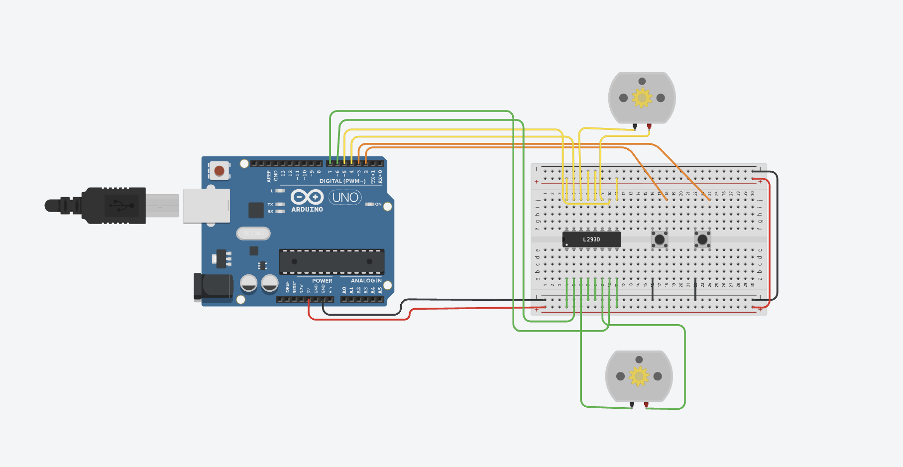
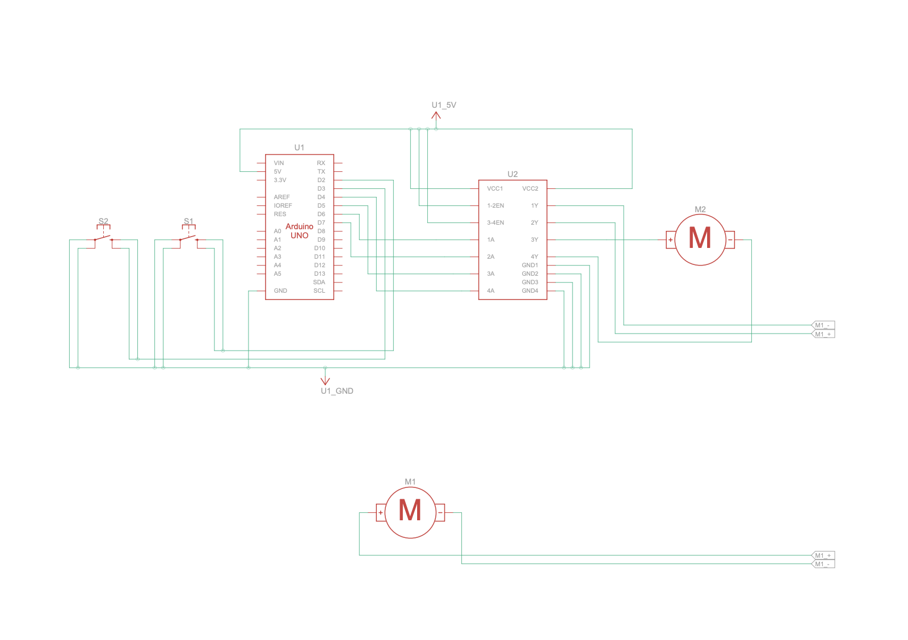

# Line Following Robot (Arduino Simulation)

A simulated line following robot built in Tinkercad Circuits using an Arduino Uno and an L293D motor driver. Two pushbuttons stand in for the left and right line sensors, because the basic Tinkercad parts have no IR sensor. A pressed button means that sensor sees the black line.

Built as the Tier 1 project of the Devotics Industrial Experience Program.

## Components

- Arduino Uno R3
- L293D motor driver IC
- 2 x DC motors (left and right wheel)
- 2 x pushbuttons (left and right sensor)
- Breadboard and jumper wires

## Circuit Diagram

## Pin Connections

| Arduino Pin | Connected To | Purpose |
|---|---|---|
| 2 | Left button | Left sensor input |
| 3 | Right button | Right sensor input |
| 4 | L293D pin 15 | Left motor forward |
| 5 | L293D pin 10 | Left motor backward |
| 6 | L293D pin 2 | Right motor forward |
| 7 | L293D pin 7 | Right motor backward |

L293D power: pins 1, 8, 9 and 16 go to 5V, and pins 4, 5, 12 and 13 go to GND. The other leg of each button goes to GND, and the code uses INPUT_PULLUP so no external resistors are needed.

## How It Works

The code reads both sensors and decides how to move:

| Left Sensor | Right Sensor | Meaning | Action |
|---|---|---|---|
| Not pressed | Not pressed | Both on white surface | Drive straight forward |
| Pressed | Not pressed | Line is on the left | Turn left (left motor stops) |
| Not pressed | Pressed | Line is on the right | Turn right (right motor stops) |
| Pressed | Pressed | Finish line | Stop both motors |

## How to Run

1. Open the Tinkercad project (link below) and click Start Simulation.
2. With no button pressed, both motors spin.
3. Hold the left or right button to see the matching motor stop.

Tinkercad project: (link to be added)

Code: [line_follower/line_follower.ino](line_follower/line_follower.ino)

## Possible Improvements

- Replace the buttons with real IR sensors on a physical robot
- Add PWM speed control on the enable pins for smoother turns
- Add a third center sensor for sharper curves

## Author

Hemant Yadav, 4th year BTech Robotics and Automation, Medicaps University
